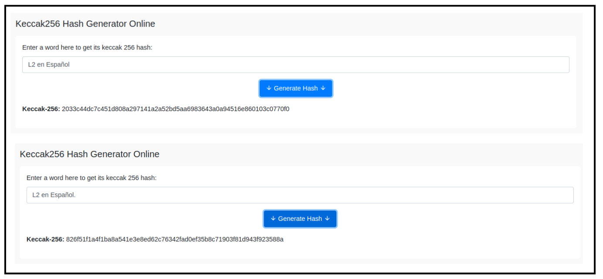

# Keccak - El nuevo SHA-3
Ahora nos centraremos en el `SHA-3` [**(Secure Hash Algorithm 3)**](https://en.wikipedia.org/wiki/SHA-3), es un estándar de función hash criptográfica diseñado por los criptógrafos Joan Daemen y Gilles Van Assche. El algoritmo utilizado en `SHA-3` se llama [**Keccak**](https://keccak.team/index.html), el cual fue [**seleccionado como el ganador del concurso**](https://www.federalregister.gov/documents/2015/08/05/2015-19181/announcing-approval-of-federal-information-processing-standard-fips-202-sha-3-standard) organizado por el Instituto Nacional de Estándares y Tecnología [(NIST)](https://en.wikipedia.org/wiki/National_Institute_of_Standards_and_Technology) para encontrar un nuevo estándar de función hash criptográfica.

A diferencia de `SHA-256`, `Keccak` utiliza una estructura y operaciones diferentes. En lugar de rondas, `Keccak` se basa en una construcción llamada función de esponja [(Sponge function)](https://en.wikipedia.org/wiki/Sponge_function), que se basa en una función pseudoaleatoria amplia o [(permutation)](https://keccak.team/glossary.html#permutation) pseudoaleatorio permitiendo ingresar **"absorbing"** y **"squeezing"**.

`Keccak-256` es una función hash criptográfica utilizada en Ethereum. Pertenece a la familia de algoritmos `SHA-3` y se emplea ampliamente en la plataforma Ethereum para diversos propósitos.

Algunos casos de uso de `Keccak-256` incluyen:

* Ethereum utiliza `Keccak-256` para garantizar la integridad de los datos y generar identificadores únicos (hash) para verificar la autenticidad de los archivos y mensajes en sistemas criptográficos.
* También se utiliza en la firma criptográfica de pequeño tamaño, donde en lugar de firmar la entrada completa, se firma el hash `Keccak-256` del mensaje o dato.
* `Keccak-256` es utilizado para obtener una identificación única y determinista de una colección de datos. Por ejemplo, en Ethereum, las direcciones de Ethereum se derivan de claves públicas o contratos utilizando la función hash unidireccional `Keccak-256`.

Las direcciones Ethereum son números hexadecimales, identificadores derivados de los últimos 20 bytes del hash `Keccak-256` de la clave pública.

A diferencia de las direcciones de Bitcoin, que están codificadas en la interfaz de usuario de todos los clientes para incluir una suma de verificación incorporada para proteger contra direcciones mal escritas, las direcciones de Ethereum se presentan como hexadecimales sin ninguna suma de verificación.

<em></em>

El algoritmo **Keccak** utiliza la [**Sponge construction**](https://keccak.team/glossary.html#sponge_construction) para procesar los datos de entrada de longitud variable para generar una salida de longitud variable. Esta construcción se basa en una función interna llamada `"F"` que opera en un número fijo de bits, denotado como `"width"` [(anchura)](https://keccak.team/glossary.html#width).

La anchura total del algoritmo Keccak se determina sumando dos componentes, el valor de `"r"` [(rate)](https://keccak.team/glossary.html#rate) y el valor de `"c"` [(capacity)](https://keccak.team/glossary.html#capacity), donde `b = r + c`.

* El valor de `"r"` representa la cantidad de bits absorbidos en cada paso de la función esponja, es decir, **la capacidad de absorción de la esponja.** Un valor de `"r"` más grande permite procesar más información en cada paso, lo que reduce la cantidad de pasos necesarios para procesar una entrada específica.
* El valor de `"c"` representa la capacidad de la esponja, es decir, **la cantidad de bits que se mantienen en el estado interno del algoritmo después de cada paso de absorción**. Estos bits se mezclan con los datos de entrada y el resultado de la función interna `"F"`. La capacidad afecta la resistencia del algoritmo a ataques criptográficos como colisiones o preimagen.

La suma de `"r"` y `"c"` da como resultado el número total de bits, `"b"`, utilizados en la función esponja de Keccak. Este valor determina la longitud del estado interno y, por lo tanto, la longitud de la salida generada por el algoritmo.

## Funcionamiento keccak
El algoritmo funciona de la siguiente manera, inicialmente la cadena de entrada se rellena con bits adicionales para enmascarar el mensaje inicial y se divide en bloques de longitud `"r"` bits. Luego, los `"b"` bits de estado se inicializan a `0`, que da inicio a la **Sponge construction** en dos fases **"absorbing"** y **"squeezing"**.

* **Fase Absorbing:** a los bloques de entrada de longitud `r-bits` se les aplica un [XOR](https://en.wikipedia.org/wiki/XOR_cipher) (toma dos bits y devuelve un resultado que es 1 si solo uno de los bits es 1, y 0 en caso contrario) a los primeros `r` bits del estado, alternándose con la función `f`. Cuando todos los bloques han sido procesados, se pasa a la siguiente fase.
* **Fase Squeezing:** los primeros `r` bits del estado son devueltos como bloques de salida, alternándose con ejecuciones de la función `f`. El número de bloques de salida es seleccionado por el usuario.

A continuación os dejamos una tabla que enumeran algunas de las diferencias entre `SHA-256` y `Keccak-256`.

<em>Algunas diferencias entre SHA-256 y Keccak-256</em>

Vemos cómo cada tipo de criptografía o función hash tiene características distintas. En el contexto actual de la computación cuántica en constante evolución, es crucial abordar las preocupaciones emergentes sobre seguridad. Algunos algoritmos criptográficos podrían ser vulnerables a los ataques cuánticos en un futuro cercano. Es en este punto donde entra en juego el concepto de criptografía [Post-Quantum](https://en.wikipedia.org/wiki/Post-quantum_cryptography).