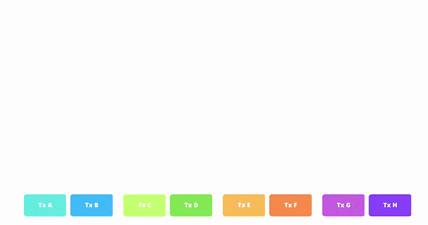

# Merkle Tree en Blockchain
Ahora que hemos comprendido mejor qué es un hash, veamos cómo en criptografía y [ciencias de la computación](https://en.wikipedia.org/wiki/Computer_science), un árbol hash, también conocido cómo [**Merkle Tree o binary Merkle tree**](https://en.wikipedia.org/wiki/Merkle_tree), es una [estructura de datos](https://en.wikipedia.org/wiki/Data_structure) utilizada para garantizar la integridad de los contenidos almacenados en un sistema, como la tecnología blockchain.

Podemos ver los Merkle Trees como una estructura de árbol en la que cada "hoja" o nodo terminal, está etiquetado con el hash criptográfico de un bloque de datos. A su vez, cada nodo que no es una hoja, también conocido como rama, nodo interior o inodo, está etiquetado con el hash criptográfico de las etiquetas de sus nodos secundarios.

La construcción de un Merkle Tree implica dividir los datos en bloques más pequeños y aplicar una función de hash criptográfico a cada uno de ellos. Luego, los bloques hash se combinan en pares y se vuelven a hashear, repitiendo este proceso hasta obtener un único hash llamado raíz de Merkle o “Merkle root”. Esta raíz se coloca en la cabecera de un bloque o transacción y se utiliza como una firma digital que representa y verifica la integridad de todos los datos incluidos en el bloque.

<em>Ejemplo de estructura de un Merkle Tree</em>

Una de las principales ventajas de los Merkle Trees es su capacidad para proporcionar una verificación eficiente y segura de los contenidos de una gran estructura de datos. Como cada nodo intermedio en el árbol está etiquetado con el hash criptográfico de las etiquetas de sus nodos secundarios, cualquier cambio realizado en los datos se reflejará en cambios en los hashes correspondientes.

En la tecnología blockchain que usan los Merkle Trees, los utilizan para garantizar la integridad de los datos almacenados en cada bloque de la cadena. Cada bloque contiene una lista de transacciones, y el Merkle Tree se construye utilizando los hashes de estas transacciones.

Cuando se agrega un nuevo bloque a la cadena, la raíz de Merkle del bloque anterior se incluye en el nuevo bloque, creando una cadena enlazada de árboles de Merkle. Esto permite verificar rápidamente la integridad de cualquier bloque en la cadena sin necesidad de verificar todos los datos desde el inicio. Además, si algún dato se modifica en un bloque, el hash del bloque cambiará, lo que afectará la raíz de Merkle y señalará la alteración en la cadena.

Algunos casos posibles de uso de los binary Merkle Trees para los diferentes esquemas pueden ser:

* **Los binary Merkle Trees:** son estructuras de datos muy eficientes para autenticar información que se presenta en formato de "lista", es decir, una secuencia de elementos consecutivos.
* **Los transaction trees:** también resultan beneficiosos, ya que una vez creado el árbol, no importa cuánto tiempo se tarde en editarlo, ya que permanecerá inmutable.
* **Los State trees:** sin embargo, cuando se trata de un árbol que almacena estados la situación se vuelve más compleja, el estado en Ethereum, que consiste en un mapa de valores clave donde:
    * **Las claves son direcciones**
    * **Los valores son las declaraciones de cuenta que incluyen:** saldo, nonce, código y almacenamiento asociados a cada cuenta, r
    * **Requiere la construcción de una prueba de transición de estado de Merkle** [(Merkle state transition proof)](https://medium.com/@chiqing/verify-ethereum-account-balance-with-state-proof-83b51ceb15cf)

Así que, comprender el funcionamiento de los State Trees y su optimización de datos es crucial en el contexto actual donde los datos y los hashes desempeñan un papel fundamental. En el caso de Ethereum, uno de los principales actores en el ámbito de los State Trees, se han incorporado modificaciones interesantes usando Patricia Merkle Trie.