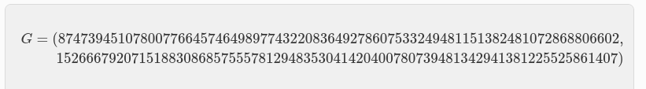

# EC en Cairo - STARK Curve
Como hemos visto en el contexto de los sistemas criptográficos, la elección de la curva elíptica adecuada es de suma importancia. En este caso, se utiliza una variante de EC la cual ha sido especialmente diseñada y optimizada para su aplicación en el entorno de Starknet.

La STARK Curve [**(EC.cairo)**](https://github.com/starkware-libs/cairo-lang/blob/361fe32d5930db340ea78fe05aedfe706f6c9405/src/starkware/cairo/common/ec.cairo) se define mediante la ecuación:

<em></em>

Los valores específicos de `α`, `β` y `p` utilizados en esta curva han sido cuidadosamente seleccionados para proporcionar propiedades criptográficas sólidas y un rendimiento eficiente en el contexto de los contratos de cuenta nativos en Starknet.

En particular, los valores de `α`, `β` (notese que es `π` “PI” sin decimales usando 67 digitos) y `p` son los siguientes:

<em></em>

Estos valores aseguran que la curva elíptica Stark-friendly cumple con los requisitos de seguridad necesarios para su aplicación en sistemas criptográficos.

Además se utiliza un punto generador [(G)](https://docs.starkware.co/starkex/crypto/stark-curve.html) específico asociado a esta curva. El punto generador `G` se define como:

<em></em>

Este punto generador desempeña un papel fundamental en el esquema de firmas digitales ECDSA, permitiendo la generación de claves públicas, como aprendimos al momento de hablar del Generador de Claves.

La elección de la curva elíptica Stark-friendly y el punto generador `G` asociado a ella proporcionan una base sólida y optimizada para la implementación de esquemas criptográficos en el entorno de Starknet. Estos elementos garantizan la seguridad y eficiencia necesarias para la creación de contratos de cuenta nativos y la verificación de firmas digitales en el sistema.

Si desea probar y adentrarse en el despliegue de cuentas en Starknet, o si está interesado en aprender cómo se generan y calculan off-chain, y luego financiar esas cuentas para que los contratos de cuenta se autodesplieguen, le animamos a seguir los ejercicios oficiales de [**Starknet-Edu Account**](https://github.com/starknet-edu/starknet-accounts/blob/answers/ES%20README.md) o las [**Guías Completas Cairo 1**](https://github.com/Nadai2010/Nadai-StarknetEs-Guia-Cairo1#configuraci%C3%B3n-de-una-cuenta) proporcionadas por [Starknet-Es](https://twitter.com/StarkNetEs) para realizar pruebas reales.