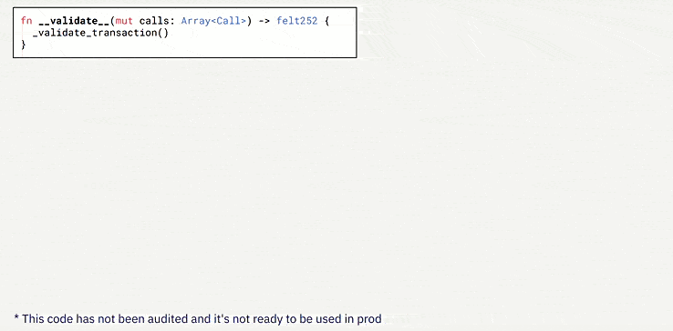

## Starknet AA

Esperamos que haya disfrutado de la primera parte, donde se presentaron conceptos generales de criptografía. Ahora nos adentraremos en un tema aún más interesante, [**Starknet**](https://www.starknet.io/en) y cómo mejora el ecosistema, exploraremos cómo los contratos de cuentas (CA) y el esquema de firmas abstraídas de Starknet ofrecen beneficios significativos frente al [ERC-4337](https://medium.com/infinitism/erc-4337-account-abstraction-without-ethereum-protocol-changes-d75c9d94dc4a).

_Si deseas aprender más sobre el concepto y las variantes del ERC-4337, te recomendamos leer esta serie de artículos en el blog de [Argent](https://www.argent.xyz/argent-x/). La serie está compuesta por la [Parte 1](https://www.argent.xyz/blog/wtf-is-account-abstraction/), [Parte 2](https://www.argent.xyz/blog/part-2-wtf-is-account-abstraction/) y [Parte 3](https://www.argent.xyz/blog/part-3-wtf-is-account-abstraction/). Argent y [Braavos](https://braavos.app/) son Smart wallets que aprovechan el poder del AA nativo en Starknet. También te recomendamos leer los artículos de Braavos de [Guide 101 AA](https://braavos.app/account-abstraction-ethereum-comprehensive-guide/) y [Security Pyramid AA](https://braavos.app/account-abstraction-security-pyramid/), los cuales presentan optimizaciones adicionales y capas de seguridad que exploraremos más adelante. Estos recursos te proporcionarán una mejor comprensión del concepto de **AA** y del **ERC-4337**._

**¡Así que sin más preámbulos, bienvenidos a Starknet!**

En el ecosistema de Starknet, se encuentran diversas metodologías para generar claves y firmas. A diferencia de las cuentas EOA, en Starknet se emplea **Account Abstraction** [**(AA)**](https://book.starknet.io/chapter_5/index.html) para la implementación de **Contract Accounts** [(CA)](https://book.starknet.io/chapter_5/index.html#ethereums_current_account_system_a_closer_look). Estos contratos son responsables de establecer la lógica en nuestras cuentas dentro de Starknet, incluyendo la validación del esquema de firma abstraído.

En lugar de utilizar ECDSA, Starknet utiliza una variación llamada [**STARK Curve**], un tipo de curva elíptica más amigable y optimizada que es nativa en el ecosistema, esta variante nos ofrece mejoras y características específicas para las necesidades de Starknet.

Lo grandioso de tener esta abstracción nativa es que permite añadir diferentes lógicas en tus esquemas o capas adicionales. Normalmente, se utiliza un sistema asimétrico usando la curva elíptica `secp256k1`, basado en la pseudoaleatoriedad y diversas operaciones matemáticas utilizando dicha curva, para generar claves privadas y públicas. Sin embargo, también se pueden añadir curvas adicionales de forma nativa al crear un CA, como lo ha hecho Braavos con la [secp256r1](https://github.com/myBraavos/efficient-secp256r1). Esta curva cuenta con un sistema de firmas integrado, mejor optimizado y preparado para dispositivos modernos, donde el signer puede almacenar los datos habilitados por biometricidad en dispositivos aislados y seguros, como el módulo "Enclave" de Apple.

La AA desempeña un papel crucial al abstraer el esquema de firmas o verificación de firmas de la ejecución. Como vimos anteriormente, podemos generar una clave privada y mediante ECDSA generar una clave pública. En este caso el poseedor de esta clave privada y del esquema de firma asociado tiene el poder de realizar transacciones en Starknet, los [dos tipos de transacciones](https://book.starknet.io/chapter_8/transactions.html) son `DEPLOY` o `INVOKE`.

<em>Contrato de Cuenta de usuario</em>

Con AA podemos modificar estas firmas o curvas. Por ejemplo, la curva `Secp256r1`, vimos que ofrece una seguridad adicional en Braavos al configurar una firma biométrica en el módulo de seguridad del enclave. De esta manera, esta firma biométrica solo puede ser añadida gracias a AA.

Todo esto es posible gracias al lenguaje de programación utilizado en la implementación, el poderoso [**Cairo**](https://starkware.co/cairo/), así que analicemos cómo Cairo incorpora esta abstracción en su programación.

En primer lugar, se necesita validar la firma y comprobar que coincide con la generada mediante ECDSA antes de proceder a la ejecución. Estas dos funciones principales son `validate` y `execute`. Además, `execute` también puede realizar múltiples llamadas utilizando `execute_calls`.

<em>Información de la Lógica separada de las funciones validate, execute</em>

Ahora analicemos cómo Cairo incorpora esta abstracción en su programación.

Veamos cómo funciona un ciclo de transacción con AA nativa y cómo se representa gráficamente este ciclo completo de firmas para detectar si es correcto y realizar la operación.

También pensemos en cómo se podrían combinar de manera eficiente firmas como ha realizado Braavos con la EC `secp256r1` o incluso realizar la verificación de firmas, como vimos con Lattice para prevenir ataques cuánticos.

<em>Ciclo completo de una firma y validación de una trnasacción</em>

Los conocimientos previos adquiridos nos han enseñado muchas cosas, una de ellas es cómo el algoritmo de Shor puede teóricamente romper ECDSA, pero no podrá romper una prueba STARK. 

En la sección de generación de STARKs, aprenderemos como gracias a sus bases de criptografía simétrica y otras variables, si alguien nos roba, hackea o perdemos la cuenta, el esquema **PQS** para la prueba no será de mucha utilidad, ya que no se ha alterado la integridad del estado de los datos, sino que por oun teórico ataque criptoanalítico se habrá obtenido tu PK, lo que permitiría mover los fondos de forma justa.

**Pero, ¿qué sucedería si tuviéramos un esquema de verificación de firmas seguro frente a un ataque cuántico?**

Aquí es donde entran en juego pequeños cambios, específicamente en la parte de validación y no de ejecución, con las mejoras en Starknet y con la ayuda de AA nativo, está implementando para prepararse para el futuro. Una posibilidad sería el uso de Lattice o Kyber, aunque el futuro no está escrito, así que ha llegado el momento de ver cómo se genera la parte de la EC.