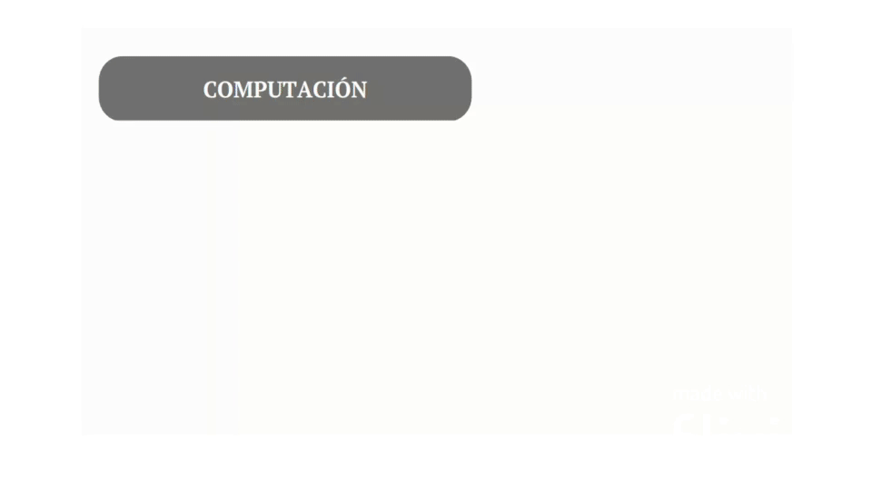

# Creando un STARK
En esta parte final del documento y después de haber explicado algunas propiedades  importantes de los polinomios y que resuelven, exploraremos la creación de una STARK desde los fundamentos matemáticos más profundos. Para obtener una comprensión completa de los procesos involucrados y cómo se puede combinar un PCP con criptografía ligera para obtener un STARK, te recomendamos revisar la serie lanzada por Starkware,que proporciona una profundización inicial más detallada.

Además, encontrarás a continuación los enlaces a cinco artículos fundamentales  traducidos al español que complementarán tu aprendizaje:

1. [Comienza el Viaje](https://github.com/Starknet-Es/Maths-StarknetEs/blob/main/Gu%C3%ADas%20Oficiales/Comienza%20el%20viaje.md)
2. [Aritmetización I](https://github.com/Starknet-Es/Maths-StarknetEs/blob/main/Gu%C3%ADas%20Oficiales/Aritmetizaci%C3%B3n%20I.md)
3. [Aritmetización II](https://github.com/Starknet-Es/Maths-StarknetEs/blob/main/Gu%C3%ADas%20Oficiales/Aritmetizaci%C3%B3n%20II.md)
4. [Pruebas de Bajo Grado](https://github.com/Starknet-Es/Maths-StarknetEs/blob/main/Gu%C3%ADas%20Oficiales/Prueba%20de%20bajo%20grado.md)
5. [Un Frameword para STARKs Eficientes](https://github.com/Starknet-Es/Maths-StarknetEs/blob/main/Gu%C3%ADas%20Oficiales/Un%20marco%20para%20STARKs%20eficientes.md)

Estos recursos adicionales te brindarán una visión más completa y práctica del proceso de creación de una STARK. También te recomendamos revisar los repositorios relacionados y los videos de creación de una STARK en Pioneros Clases 3, un Basecamp descentralizado en Español creado por Starknet, o el den inglés impartido por Eli Ben Saason

Nos interesa la Integridad Computacional (CI), por ejemplo, saber que el programa de Cairo que escribiste se calculó correctamente.

* Tenemos que pasar por una serie de transformaciones desde el trazado de nuestro programa, hasta la prueba.
* La primera parte de esto se llama aritmetización, y consiste en tomar nuestra traza y convertirla en un conjunto de polinomios.
* Nuestro problema se convierte entonces en uno en el que el prover intenta convencer a un verificador de que el polinomio es de grado bajo.
* El verificador está convencido de que el polinomio es de grado bajo si y sólo si el cálculo original es correcto (salvo una probabilidad infinitesimalmente pequeña).

<em></em>

El uso de la aletoriedad es muy importante para el prover y el verifier, mientras que el prover utiliza la aleatoriedad para alcanzar el conocimiento cero, el verificador utiliza la aleatoriedad al generar consultas al prover, para detectar trampas por parte del prover.

Gran parte del trabajo que se realiza al crear una prueba consiste en garantizar que sea sucinta y que pueda elaborarse y verificarse en un tiempo razonable. Por tanto, nuestro plan consistirá en:

* Reformular la traza de ejecución como un polinomio,
* Extenderlo a un gran dominio,
* Transformarlo, utilizando las restricciones polinómicas, en otro polinomio que se garantiza que es de grado bajo si y sólo si la traza de ejecución es válida.
* Queremos lograr una verificación sucinta, en la que el verificador de la declaración CI requiera exponencialmente menos recursos que los necesarios para la repetición ingenua.

