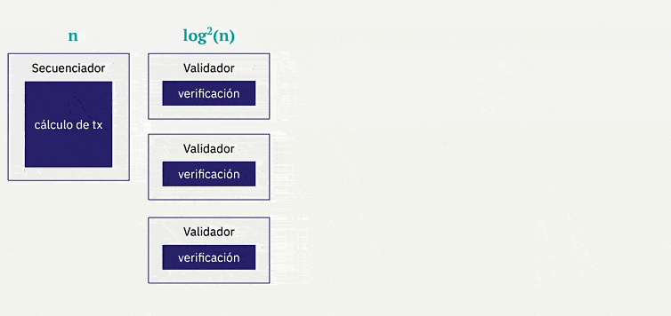
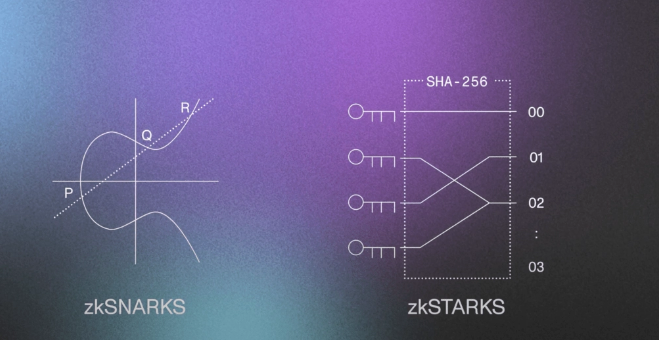

## Propiedas de las STARKs
Hemos visto cómo diferenciar los tipos de pruebas según su criptografía, así como la comparativa entre varias de ellas. Ahora veamos cuáles son las dos propiedades esenciales en las pruebas y cómo se pueden lograr, antes de pasar a la definición de STARK

1. **Succintness (Sucintez):** exigimos que nuestras pruebas y, en particular, el tiempo de verificación sean sucintos, es decir, que sean órdenes de magnitud más pequeños que el tiempo necesario para calcular nuestro programa. De lo contrario, no habría ninguna ventaja para el verificador en utilizar la prueba en lugar del cálculo original.
2. **Heurística Fiat-Shamir:** este es un proceso mediante el cual podemos convertir una prueba interactiva en una no interactiva. Funciona proporcionando compromisos a los mensajes que formarían la interacción y las funciones hash se utilizan como fuente de aleatoriedad.

Uno de los protocolos que se utiliza en sistemas criptográficos, como los STARKs, para abordar el desafío de verificar eficientemente la corrección de grandes cálculos polinomiales es FRI (Fast Reed-Solomon Interactive Oracle Proofs of Proximity).

FRI utiliza códigos de corrección de errores Reed-Solomon para permitir pruebas interactivas eficientes. Esto significa que el probador puede proporcionar una prueba corta de la corrección del cálculo, mientras que el verificador puede verificar de manera eficiente la validez de la prueba. Este proceso interactivo permite realizar pruebas de proximidad, donde el verificador puede verificar de manera eficiente si el cálculo reclamado se acerca al resultado correcto sin tener que evaluar por completo todo el polinomio.

> El conjunto de operaciones matemáticas, bases criptográficas, FRI y otras propiedades, como Fiat-Shamir, permite que las STARKs logren seguridad cuántica y escalabilidad, al tiempo que proporcionan una verificación transparente y eficiente de cálculos complejos.

Podemos decir entonces que los STARKs demuestran la correcta operación de una máquina virtual al demostrar que la traza de ejecución asociada es válida con respecto al AIR dado. En términos generales, las trazas de ejecución se organizan como tablas de números, y el protocolo STARK demuestra que estos números resuelven conjuntamente un sistema de polinomios.

Así vemos cómo algunas de estas propiedades, como la succintez, pueden venir de forma natural en las STARKs, y cómo el principio de Fiat-Shamir permite realizar pruebas interactivas. Además, contar con FRI como corrección de errores amplía las capacidades y visión de las STARKs, así que ahora vayamos a su definición

## S = Scalable

Una de las principales ventajas de STARKs es que al trasladar un cálculo fuera de la cadena, se reducen de manera exponencial los costos de verificación en la cadena de bloques. El proceso de creación de una prueba fuera de la cadena tiene un costo similar al de solicitar a un único nodo de la cadena de bloques que realice el cálculo.

La producción de pruebas no resulta considerablemente más costosa que la ejecución del cálculo original, y la validación de las pruebas es **exponencialmente más rápida** que la ejecución del cálculo original. Además, las pruebas son **considerablemente más cortas** en tamaño que el cálculo original.

Otra ventaja importante es que a medida que se incrementa la cantidad de cómputo, su crecimiento es casi lineal. Esto la convierte en una opción ideal para procesar transacciones a gran escala.

<em></em>

Además, se puede aprovechar la capacidad de paralelización de pruebas por el prover y recursividad de los STRAKs eficentes para mejorar significativamente la escalabilidad.

<em></em>

## T = Transparent

La seguridad de las STARKs no depende de ceremonias de configuración elaboradas que puedan generar residuos tóxicos criptográficos, como ocurre en otras tecnologías de pruebas.

El uso de STARKs para iniciar la prueba basándose en criptografía simétrica, pseudoaleatoriedad y las matemáticas proporciona un inicio de ceremonia transparente y elimina la necesidad de una configuración de confianza inicial (trusted setup), lo que asegura la ausencia de residuos tóxicos y mejora la seguridad y confiabilidad general del sistema criptográfico.

Una característica importante de las STARKs es su construcción basada en el trabajo de [Micali](https://es.wikipedia.org/wiki/Silvio_Micali). En esta construcción, la única criptografía necesaria para producir o validar una prueba corta `𝛑` es una **función hash criptográfica** `H`, como `SHA-256` o `Keccak`. La elección de `H` se convierte en el único **"parámetro global"** que todos los usuarios del sistema de prueba deben conocer, y **esta elección puede hacerse de manera pública, garantizando la transparencia de las pruebas criptográficas obtenidas a través de las STARKs.**

Sin embargo siempre comparamos STARKs con SNARKs o pruebas derivadas de criptografía asimétrica como las [Pinocchio](https://eprint.iacr.org/2013/279.pdf) de ECC, pero cada una tiene sus varientes y esquemas diversos,  aunque para una explicación más clara cogeremos el ejemplo de [VB en un artículo sobre zk-SNARKs](https://medium.com/@VitalikButerin/zk-snarks-under-the-hood-b33151a013f6).

<em></em>

Imaginemos que tenemos un par de puntos `P` y `Q`, donde `P * k = Q`, y tienes un punto `C`, entonces no es posible obtener `C * k` a menos que `C` esté **"derivado"** de alguna manera que conozcas a partir de `P`. Esto puede parecer intuitivamente obvio, pero esta suposición en realidad no puede derivarse de ninguna otra suposición (por ejemplo, la dificultad del logaritmo discreto) que usualmente utilizamos al probar la seguridad de los protocolos basados en EC. Por lo tanto, los SNARKs se basan en una base un tanto más frágil que la ECC en general.

Supongamos que cae del cielo un par de puntos `(P, Q)`, donde `P * k = Q`, pero nadie conoce el valor de `k`. Ahora, supongamos que yo presento un par de puntos `(R, S)` donde `R * k = S`. Entonces, la suposición de conocimiento del extremo de la curva (KoE, por sus siglas en inglés) implica que la única forma en que podría haber creado ese par de puntos es tomando `P` y `Q`, y multiplicándolos por un factor `r` que **solo yo conozco**. También hay que tener en cuenta que, gracias a la magia de las parejas de curvas elípticas, verificar que `R = k * S` no requiere conocer `k`; en su lugar, simplemente puedes comprobar si `e(R, Q) = e(P, S)`, donde e es una función de emparejamiento de curvas elípticas.

Hagamos algo más interesante. Supongamos que caen del cielo diez pares de puntos: `(P_1, Q_1), (P_2, Q_2) ... (P_10, Q_10)`. En todos los casos, se cumple que `P_i * k = Q_i`, ahora, supongamos que te proporciono un par de puntos `(R, S)` donde `R * k = S`.

**¿Qué sabemos ahora?** Que `R` es una combinación lineal de la forma `P_1 * i_1 + P_2 * i_2 + ... + P_10 * i_10`, donde yo conozco los coeficientes `i_1, i_2 ... i_10`, es decir, la única forma de obtener un par de puntos `(R, S)` de esta manera es tomando algunos múltiplos de `P_1, P_2 ... P_10` y sumándolos, y hacer el mismo cálculo con `Q_1, Q_2 ... Q_10.`

Enrtonces tenemos que tener en cuenta que dado cualquier conjunto específico de puntos `P_1…P_10` para los que puedas querer verificar combinaciones lineales, en realidad no puedes crear los puntos correspondientes `Q_1…Q_10` sin conocer el valor de `k`, y si conoces el valor de `k`, entonces puedes crear un par `(R, S)` donde `R * k = S` para cualquier `R` que desees, sin necesidad de crear una combinación lineal.

**Por lo tanto, para que esto funcione, es absolutamente imperativo que quien cree esos puntos sea confiable y realmente elimine `k` una vez que haya creado los diez puntos.**

Se debe destacar la importancia de las ceremonias de ajuste inicial en ciertos casos, como en implementaciones de sistemas de votación. En estos casos, es crucial tener en cuenta quién ha sido el creador de los puntos y si existe alguna posibilidad de manipulación o si se ha eliminado correctamente el valor de k. Esto es necesario para lograr transparencia y evitar depender de estas verificaciones. En este sentido, los STARKs se presentan como una solución prometedora y **EFICIENTE**, ya que proporcionan una base sólida que elimina la necesidad de confiar en dichas ceremonias de ajuste inicial.

## ARK = Argument of Knowledge
Los argumentos de conocimiento “ARK” son llevados a cabo por el prover que opera fuera de la cadena principal. Este probador se encarga de ejecutar el cálculo requerido para la prueba, utilizando las entradas auxiliares necesarias, la realización de la prueba fuera de la cadena principal es clave, ya que debe garantizar la integridad y la confiabilidad del proceso.

La principal ventaja de esta metodología es que permite una verificación auténtica y matemáticamente sólida. Después de que el probador haya realizado el cálculo, puede proporcionar la prueba generada a cualquier computadora o entidad interesada para su verificación, haciendo uso de ARK sto significa que cualquier sistema informático puede confirmar la validez de la prueba de manera independiente.